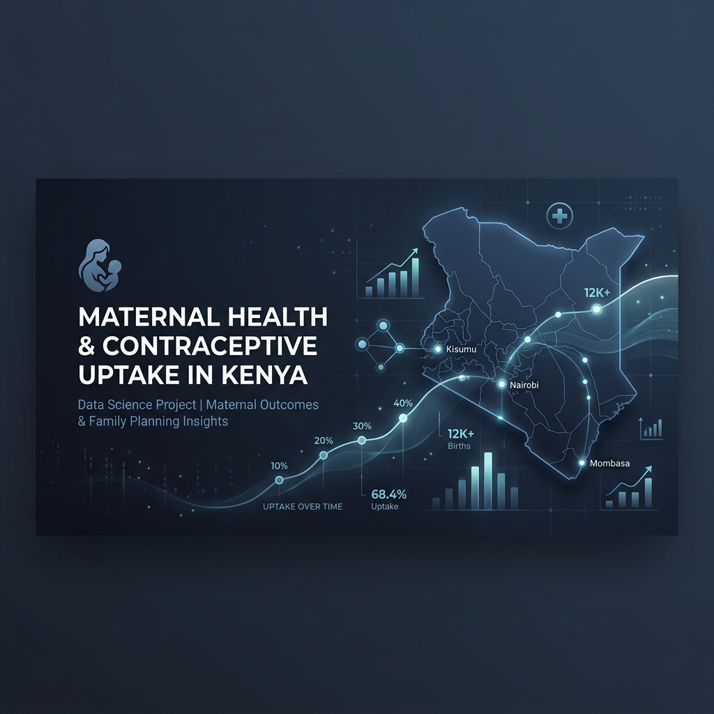

# Predicting Contraceptive Use Among Kenyan Women.




## Data Cleaning · EDA · Modelling · SHAP Explainability · Deployment
### The Insight Architects Group

> Kenya's family planning story hides a 56-point gap between counties — from about 1% modern contraceptive use in Mandera to 57% in Embu. Using the 2022 Kenya Demographic and Health Survey (32,156 women), we train a LightGBM model that predicts a woman's contraceptive method type from her sociodemographic profile (Macro-AUC 0.798, ahead of a logistic-regression baseline at 0.764), explain it with SHAP, and ship it as a live REST API so health teams can target outreach where non-use is highest.


---

---

## Project at a Glance

| | |
|---|---|
| **Dataset** | Kenya Demographic and Health Survey (KDHS) 2022 — Women's Individual Recode |
| **Respondents** | 32,156 women aged 15–49, all 47 Kenyan counties |
| **Target variable** | `contraceptive_use` — four classes (No method · Folkloric · Traditional · Modern) |
| **Methodology** | CRISP-DM |
| **Notebook** | 130 cells · 19 embedded charts |
| **Models trained** | 5 (Logistic Regression, Random Forest, LightGBM, Deep MLP, TabTransformer) |
| **Selected model** | LightGBM — Accuracy 72.4% · Macro-AUC 0.798 |
| **Live API** | https://kdhs-contraceptive-api.onrender.com |
| **Tools** | Python · scikit-learn · LightGBM · PyTorch · SHAP · Flask · Render.com |

---

## Key Insights

1. Modern contraceptive use ranges from about 1% in Mandera to 57% in Embu, making county the single strongest signal in the whole dataset.
2. Wealth behaves like a cliff rather than a slope, jumping from 25% in the poorest quintile to around 41% above it, then staying flat.
3. Education outweighs wealth, since women with no education stay at roughly 12% modern use regardless of how wealthy they are.
4. LightGBM was selected for deployment with the best accuracy at 72.4% and the best macro AUC at 0.798 across all five models.
5. SHAP ranks age and living children as the top drivers, with employment the most actionable lever and arid county a genuine structural barrier even after controlling for wealth, education, and religion.

---

## The Team — The Insight Architects

| Member | Role |
|---|---|
| Clare Simiyu | Data Science |
| Antony Sila | Data Science |
| David Theuri | Data Science |
| Shadrack Symekah | Data Science |
| Joy Nyuguto | Data Science |
| Martin Kitema | Data Science |

---

## Table of Contents

- [Key Insights](#key-insights)
1. [Problem Statement](#1-problem-statement)
   - [Business Understanding](#business-understanding)
   - [Stakeholders](#stakeholders)
2. [Dataset Description](#2-dataset-description)
3. [Repository Structure](#3-repository-structure)
4. [Environment Setup](#4-environment-setup)
5. [How to Run the Notebook](#5-how-to-run-the-notebook)
6. [Notebook Walkthrough — Section by Section](#6-notebook-walkthrough--section-by-section)
7. [EDA — Charts and Findings](#7-eda--charts-and-findings)
8. [Feature Engineering Catalogue](#8-feature-engineering-catalogue)
9. [Model Performance Summary](#9-model-performance-summary)
10. [SHAP Explainability Guide](#10-shap-explainability-guide)
11. [Key Findings](#11-key-findings)
12. [Business Recommendations](#12-business-recommendations)
13. [Deployment — Live API on Render.com](#13-deployment--live-api-on-rendercom)
14. [Design Decisions and Honest Limitations](#14-design-decisions-and-honest-limitations)
15. [Conclusion](#15-conclusion)
16. [References](#16-references)

---

## 1. Problem Statement

Kenya's national family planning statistics tell an encouraging story. Modern contraceptive use among married women has improved significantly over three decades. But national averages hide a reality that aggregate reporting cannot surface: in Mandera, barely 1 in 100 women uses a modern method. In Embu, more than half do. That 56-percentage-point gap between two counties in the same country is not a rounding error — it represents a structural inequality in access, information, and agency.

The problem with how family planning programmes currently operate is that they tend to distribute resources uniformly rather than where they are needed most. Without a data-driven way to identify *which specific combination* of sociodemographic characteristics predicts genuine contraceptive non-use, outreach budgets get spread thin and the women who most need contact are hardest to reach.

This project builds a machine learning pipeline that changes that. Using the 2022 Kenya Demographic and Health Survey — the most detailed snapshot of Kenyan women's reproductive health in years — we train a model that predicts which contraceptive method type a woman is currently using based on who she is and where she lives. Then we explain those predictions using SHAP, translate them into recommendations that policy teams can act on, and deploy the model as a live REST API that county health officers can query without writing a line of code.

---
## Business Understanding

Kenya has made real progress in family planning over three decades, yet uptake remains deeply uneven across its 47 counties. According to the 2022 Kenya Demographic and Health Survey, modern contraceptive use among married women reached about 57% nationally, but arid and semi-arid counties sit far below that average (KNBS & ICF, 2023). Manual analysis of a large, multi-variable survey is impractical for health planners, so machine learning is used to automatically flag the profiles of women most likely to be non-users. The goal is to move past describing the inequality and toward predicting, explaining, and acting on it.

## Stakeholders

- **Ministry of Health, Division of Reproductive Health** — locate high non-use counties and groups, allocate officers and resources
- **County Health Management Teams** — build county-specific risk profiles for local outreach
- **UNFPA Kenya** — direct funding and technical support to the highest-risk segments
- **USAID Kenya** — evaluate programmes and redirect investment to underserved regions
- **FP2030** — track predicted non-use over time against family planning targets
- **Community Health Promoters** — prioritise household visits in high-risk clusters


## 2. Dataset Description

### Source

| Field | Detail |
|---|---|
| **Name** | Kenya Demographic and Health Survey 2022 |
| **Module** | Women's Individual Recode (IR file — DHS-7 standard) |
| **Implementing body** | Kenya National Bureau of Statistics (KNBS) |
| **Technical support** | ICF International / The DHS Programme |
| **Funding** | USAID |
| **Raw file** | 32,156 rows × 5,925 columns |
| **Working file** | 32,156 rows × 20 selected columns |

### Selected Variables

| DHS code | Working name | Type | Description |
|---|---|---|---|
| `v012` | `age` | Integer | Age in completed years |
| `v013` | `age_group` | Categorical | 5-year band: 15–19 through 45–49 |
| `v024` | `county` | Categorical | 47 Kenyan counties |
| `v025` | `residence_type` | Binary | Urban / Rural |
| `v106` | `education_level` | Ordinal | No education · Primary · Secondary · Higher |
| `v130` | `religion` | Categorical | 10 religious affiliations |
| `v136` | `household_size` | Integer | Number of household members |
| `v151` | `household_head_sex` | Binary | Male / Female |
| `v190` | `wealth_index` | Ordinal | DHS wealth quintile: Poorest → Richest |
| `v201` | `children_ever_born` | Integer | Total children ever born |
| `v212` | `age_first_birth` | Float | Age at first birth (structurally missing if no births) |
| `v218` | `living_children` | Integer | Number of children currently alive |
| `v228` | `pregnancy_loss` | Binary | Has ever had a pregnancy loss |
| `v302a` | `ever_used_contraceptive` | Categorical | Contraceptive history — **EDA only, dropped before modelling** |
| `v313` | `contraceptive_use` | **Target** | Current method type — 4 classes |
| `v501` | `marital_status` | Categorical | 6 categories |
| `v502` | `union_status` | Categorical | Currently / Formerly / Never in union |
| `v701` | `partner_education` | Ordinal | Partner's education level |
| `v714` | `currently_working` | Binary | Currently employed |

### Target Variable

| Class | Count | % | Notes |
|---|---|---|---|
| **No method** | 18,694 | 58.1% | Dominant majority class |
| **Modern** | 12,195 | 37.9% | Pills, injection, implant, IUD, condom, sterilisation |
| **Traditional** | 1,214 | 3.8% | Rhythm, withdrawal, abstinence |
| **Folkloric** | 53 | 0.2% | Herbs, amulets, folk remedies |

The 53-row Folkloric class is the single most important structural constraint in the entire dataset — it is why we use SMOTE, macro-averaged metrics, and why we are honest with stakeholders about the model's limitations.

### Missing Values

| Column | Missing | Why | Resolution |
|---|---|---|---|
| `age_first_birth` | 8,813 (27.4%) | Only asked of women who have given birth | Filled with `0`; `has_given_birth` binary flag created |
| `partner_education` | ~14,000 | Only asked of women with a current partner | Filled with `'No partner'` as a valid sixth category |

**No rows were dropped.** All 32,156 respondents are retained throughout.

---

## 3. Repository Structure

```
kdhs_project/
│
├── KDHS_2022_Capstone.ipynb         ← Main notebook (130 cells, 19 embedded charts)
├── presentation.pdf                 ← Non-technical stakeholder slides
├── KDHS_2022_women.csv              ← Raw dataset — must sit here at runtime
├── README.md                        ← This file
├── images/
│   └── header.png                   ← README header banner
│
└── deployment/                      ← Standalone production API
    ├── app.py                       ← Flask REST API
    ├── feature_engineering.py       ← Shared feature-engineering function
    ├── contraceptive_model_bundle.joblib  ← Trained LightGBM pipeline (5.6 MB)
    ├── templates/
    │   └── index.html               ← HTML form front-end (group-branded)
    ├── sample_request.json          ← Example API payload
    ├── requirements.txt             ← Production dependencies
    ├── Dockerfile                   ← Container build — gunicorn, 4 workers
    ├── render.yaml                  ← One-click Render.com deployment config
    └── .dockerignore
```

> `contraceptive_model_bundle.joblib` is generated at the end of Section 15 when the notebook runs end-to-end. If you only want to run the API without retraining, the pre-built bundle is available in the deployment package.

**Quick links:**
- Final notebook → [`KDHS_2022_Capstone.ipynb`](KDHS_2022_Capstone.ipynb)
- Stakeholder presentation → [`presentation.pdf`](presentation.pdf)
- Live API → [kdhs-contraceptive-api.onrender.com](https://kdhs-contraceptive-api.onrender.com)
- Reproduction steps → [Section 4 (Environment Setup)](#4-environment-setup) and [Section 5 (How to Run the Notebook)](#5-how-to-run-the-notebook)

---

## 4. Environment Setup

### What you need

| Requirement | Version tested |
|---|---|
| Python | 3.10 – 3.12 |
| Jupyter Notebook / JupyterLab | Any current |
| RAM | 4 GB minimum · 8 GB recommended |
| Git Bash | For Windows deployment commands |

### Install for the full notebook

```bash
cd kdhs_project

python -m venv venv
source venv/Scripts/activate        # Windows Git Bash
# source venv/bin/activate           # macOS / Linux

pip install pandas numpy matplotlib seaborn scipy \
            scikit-learn lightgbm imbalanced-learn shap \
            torch jupyter pillow
```

### Install for the API only

```bash
cd deployment
pip install -r requirements.txt
```

### Notes by platform

| Issue | Fix |
|---|---|
| `lightgbm` fails on Windows | Install the [Microsoft Visual C++ Redistributable](https://aka.ms/vs/17/release/vc_redist.x64.exe) first |
| `torch` takes too long / too much space | Only needed for Sections 11b and 11c — you can skip those cells if you only want the classical models |
| `shap` version error | Requires `shap >= 0.52` — the multi-output TreeExplainer API changed in earlier versions |
| `imbalanced-learn` not found | Separate from scikit-learn — must be installed explicitly |
| CSV not found at runtime | `KDHS_2022_women.csv` must be in the same folder as the notebook |

---

## 5. How to Run the Notebook

```bash
# From the project root — same folder as KDHS_2022_women.csv
jupyter notebook KDHS_2022_Capstone.ipynb
```

In Jupyter: **Kernel → Restart & Run All**

**Expected runtime:** 25–45 minutes on a modern CPU. The three slowest stages:

1. SHAP computation on 1,500 test respondents (~5–8 minutes)
2. LightGBM learning-curve refit in Section 12 (~3–5 minutes)
3. PyTorch training in Sections 11b and 11c (~8–15 minutes combined)

**Important rules:**
- `KDHS_2022_women.csv` must be in the same directory as the notebook — the data-loading cell uses a relative path
- Never run cells out of order — each section builds on variables created by the ones before it
- If you restart mid-session, always go back to Cell 1 and run from the top

---

## 6. Notebook Walkthrough — Section by Section

The notebook is structured around 15 numbered sections. Here is what each one does and why it matters.

---

### Section 1 — Business Understanding *(Cell 0)*

Sets the scene. Explains Kenya's family planning inequality in plain language, frames the prediction problem in terms of real public health stakes, introduces the six stakeholder groups, lists the success metrics, and poses the five research questions the notebook is designed to answer.

The tone here is deliberately human — we want anyone reading this, not just data scientists, to understand why this work matters before we start showing them code.

---

### Section 2 — Setup & Imports *(Cells 1–3)*

Installs SHAP if not already present, then loads every Python library used across all 130 cells in one place. All imports live here — not scattered through the notebook — so you will never encounter a `NameError` midway through because something was not imported.

---

### Section 3 — Data Understanding *(Cells 4–14)*

Gets acquainted with the raw data. We load the dataset, look at its shape, take a quick numeric summary of the raw columns (before decoding), and show the first few rows. Then we check for missing values, look at the raw distribution of the target variable, and investigate the 274 rows flagged as apparent duplicates — confirming by their unique respondent IDs that they are genuinely different women, not errors.

**What we establish here:** 32,156 rows, 20 working columns, two structural missing value patterns, and zero real duplicates.

---

### Section 4 — Data Cleaning *(Cells 15–25)*

Three decisions, each explained transparently:

**4.1 Decoding categorical codes.** Every DHS integer code is translated into a readable label using dictionaries verified against the DHS-7 Recode Manual. All 47 county codes are mapped to their official Kenyan county names.

**4.2 Handling structural missing values.** `age_first_birth` gaps belong to women who have never given birth — we fill them with 0 and create a `has_given_birth` flag. `partner_education` gaps belong to women without a current partner — we fill them with `'No partner'` as a valid sixth category. Neither is an error to impute away; both are structural absences.

**4.3 Keeping all rows.** The 274 apparent duplicates are confirmed as distinct women sharing similar profiles. All 32,156 rows are retained.

Two assertion checks confirm the cleaning worked, followed by a before/after summary table.

---

### Section 5 — Exploratory Data Analysis *(Cells 26–66)*

The biggest section in the notebook, and the one that shapes everything that follows. We work through three layers:

**Univariate (5.1–5.5):** How each variable is distributed on its own — target variable, age, education, wealth, and residence type.

**Bivariate (5.6–5.9):** How modern contraceptive use varies across groups — education level, wealth index, residence type, and county. Each chart shows what percentage of women in each group use a modern method versus not.

**Multivariate (5.10–5.11):** What happens when we look at education and wealth together, and how the numeric variables relate to each other.

Every chart has an Insight cell below it explaining what the finding means — not just what the numbers are, but what they imply for the modelling decisions ahead.

See Section 7 of this README for the full chart-by-chart breakdown.

---

### Section 6 — Key EDA Findings & Modelling Implications *(Cell 67)*

A structured bridge from the exploratory analysis to the modelling pipeline. Eight findings, each paired with the specific action we will take because of it. If you want to understand why a feature engineering decision was made, this is the table to look at.

---

### Section 7 — Feature Engineering *(Cells 68–70)*

Transforms the cleaned 20-column frame into a 37-feature model-ready dataset. We drop two columns (`caseid` — an identifier; `ever_used_contraceptive` — leakage with the target) and create 18 new features. Every single one traces back to a specific EDA finding.

See Section 8 of this README for the full catalogue.

---

### Section 8 — Train / Test Split & Class Imbalance *(Cells 71–74)*

We split the data into 80% training and 20% test using a stratified split, then fit the preprocessing pipeline (StandardScaler + OneHotEncoder) on training data only. The resulting feature matrix has 126 columns after one-hot encoding.

SMOTE is then applied to the training set only — expanding all four classes to 14,955 rows each. The test set is never touched, so our reported metrics reflect the real-world class imbalance the deployed model will actually encounter.

---

### Section 9 — Model 1: Logistic Regression *(Cells 75–79)*

** The baseline.** A linear classifier — the most interpretable in the suite. `max_iter=2000`, default L2 regularisation. Dashboard: Coefficient Weights (Top 10, "Modern" class) · Confusion Matrix · ROC-AUC · Precision-Recall.

Every subsequent model must beat this AUC (0.764) to justify its added complexity.

**Result:** Accuracy 0.548 · Macro-F1 0.354 · Macro-AUC 0.764

---

### Section 10 — Model 2: Random Forest *(Cells 80–83)*

**  Bagging ensemble.** 300 trees, `max_depth=14`, `min_samples_leaf=5`, `class_weight='balanced'`. Finds the non-linear wealth cliff and county-level patterns the linear model cannot reach. Dashboard: Feature Importance (Top 10) · Confusion Matrix · ROC-AUC · Precision-Recall.

**Result:** Accuracy 0.706 · **Macro-F1 0.390 (best of all models)** · Macro-AUC 0.775

---

### Section 11 — Model 3: LightGBM *(Cells 84–87)*

** Selected for deployment.** Gradient-boosted trees — histogram-based splitting and leaf-wise growth. The learning curve in the dashboard shows validation loss plateauing at iteration 226, confirming no meaningful overfitting despite the SMOTE-expanded training set. Dashboard: Learning Curve · Confusion Matrix · ROC-AUC · Precision-Recall.

Configuration: `n_estimators=400` · `learning_rate=0.05` · `max_depth=7` · `num_leaves=31` · `subsample=0.8` · `colsample_bytree=0.8` · `class_weight='balanced'`

**Result:** **Accuracy 0.724 (best)** · Macro-F1 0.367 · **Macro-AUC 0.798 (best)**

---

### Section 11b — Model 4: Deep Learning MLP *(Cells 88–93)*

** Four-layer PyTorch network.** Linear(126→256)+BatchNorm+ReLU+Dropout → Linear(256→128)+BatchNorm+ReLU+Dropout → Linear(128→64)+BatchNorm+ReLU+Dropout → Linear(64→4). Adam optimiser, 40 epochs, `ReduceLROnPlateau` scheduler. Dashboard: Training Curve (loss + accuracy, dual-axis) · Confusion Matrix · ROC-AUC · Precision-Recall.

**Result:** Accuracy 0.703 · Macro-F1 0.385 · Macro-AUC 0.751

---

### Section 11c — Model 5: TabTransformer *(Cells 94–100)*

** Self-attention across categorical feature tokens.** Each of the 13 categorical columns becomes a 16-dimensional learned embedding. Two-head self-attention across those 13 tokens lets the model learn which categorical features are most informative given the values of others. 43,044 total parameters. Dashboard: Training Curve · Confusion Matrix · ROC-AUC · Precision-Recall.

The TabTransformer achieves 34% recall on the Traditional class — by far the highest of any model — because self-attention captures the three-way religion × county × union-status interaction that one-hot trees and flat networks approximate poorly.

**Result:** Accuracy 0.648 · Macro-F1 0.384 · Macro-AUC 0.754 · **Traditional recall 34% (best)**

---

### Section 12 — Model Comparison & Selection *(Cells 101–103)*

A **5-row × 4-column side-by-side grid** places every model's complete dashboard in one figure. Scan down any column to compare all five models on the same metric. Scan across any row to read one model in full. A metric strip (Accuracy · Macro-F1 · Macro-AUC) sits above each confusion matrix.

**LightGBM selected** — best Macro-AUC, best accuracy, native SHAP support, 5.6 MB bundle, sub-millisecond inference, no GPU required in production.

---

### Section 13 — SHAP Explainability *(Cells 104–119)*

`shap.TreeExplainer` on the selected LightGBM model, applied to 1,500 held-out test respondents. Five complementary views — see Section 10 of this README for the full visual guide.

---

### Section 14 — Business Recommendations *(Cell 120)*

Six SHAP-grounded recommendations for the Ministry of Health, County Health Management Teams, UNFPA, and USAID Kenya. Every recommendation cites the specific SHAP weight or EDA finding that supports it. See Section 12 of this README for the full summary.

---

### Section 15 — Deployment *(Cells 121–129)*

Serialises the LightGBM pipeline to `contraceptive_model_bundle.joblib` (5.6 MB). Uses `%%writefile` to generate `feature_engineering.py` and `app.py` directly from the notebook. Tests the API end-to-end via Flask's test client. Closes with documentation of the live Render.com deployment, all four API endpoints, and the redeployment workflow.

---

## 7. EDA — Charts and Findings

| Chart | Section | Visual type | Key finding |
|---|---|---|---|
| Target distribution | 5.1 | Donut + horizontal bar | 58.1% No method · 37.9% Modern · 3.8% Traditional · 0.2% Folkloric — severe imbalance |
| Age distribution | 5.2 | Gradient histogram + KDE | Mean age 29.1 · right-skewed · concentrated in the 20s |
| Education distribution | 5.3 | Bar chart | Primary (37%) and Secondary (37%) most common · 12% have no education |
| Wealth distribution | 5.4 | Bar chart | Near-uniform across quintiles — roughly 18–22% each |
| Residence type | 5.5 | Bar chart | 62% rural · 38% urban |
| Modern use by education | 5.6 | Grouped bar | No-education: 12% · Primary: 44% · Secondary: 37% (life-stage dip) · Higher: 46% |
| Modern use by wealth | 5.7 | Grouped bar | Poorest: 25% → Poorer: 41% (big jump) · above Poorer barely changes — cliff not gradient |
| Modern use by residence | 5.8 | Grouped bar | Urban 38% vs Rural 38% — essentially identical |
| Modern use by county | 5.9 | Diverging lollipop | Embu 57% down to Mandera 1.2% — a 56-point spread across 47 counties |
| Education × Wealth | 5.10 | Heatmap | Education matters more than wealth · no-education women have low use regardless of wealth quintile |
| Numeric correlations | 5.11 | Correlation heatmap | `children_ever_born` and `living_children` correlate at r = 0.98 — near-identical |

---

## 8. Feature Engineering Catalogue

Eighteen features created — each one traceable to a specific EDA finding. If we could not point to one, we did not add it.

| Feature | Definition | EDA motivation |
|---|---|---|
| `education_level_ord` | No education=0 · Primary=1 · Secondary=2 · Higher=3 | Ordinal encoding preserves natural order; keeps the variable single-dimensional |
| `wealth_index_ord` | Poorest=0 · Poorer=1 · Middle=2 · Richer=3 · Richest=4 | Captures the wealth cliff (§5.7) without inflating feature space with dummies |
| `partner_education_ord` | No partner=−1 · No education=0 · Higher=3 | Makes partner education numeric; −1 separates "no partner" from "uneducated partner" |
| `age_group_ord` | 15–19=0 · … · 45–49=6 | Ordered alternative to 7-level nominal |
| `education_gap` | `partner_edu_ord − edu_ord` (0 if no partner) | Within-couple education asymmetry — linked to contraceptive negotiation in DHS literature |
| `has_partner` | 1 if partner education ≠ 'No partner' | Makes structural missing data in `partner_education` explicitly binary |
| `child_density` | `children_ever_born / household_size` | Normalises fertility by household context |
| `surviving_ratio` | `living_children / children_ever_born` (1.0 if no births) | Extracts child-mortality signal without re-introducing the r = 0.98 collinearity |
| `child_loss` | `children_ever_born − living_children` | Direct experience of child loss — known to influence future fertility decisions |
| `is_in_union` | 1 if `union_status = 'Currently in union'` | Isolates the union/non-union boundary — the clearest enabler of modern use in SHAP |
| `is_married_or_union` | 1 if married or living together | Pregnancy-exposure binary for targeting |
| `urban` | 1 if Urban | Binary recode — friendlier to MLP/Transformer numeric pathways |
| `employed` | 1 if currently working | 3rd highest global SHAP importance — most actionable top-5 driver |
| `female_hh_head` | 1 if household head is female | Household gender dynamics |
| `had_pregnancy_loss` | 1 if ever had a pregnancy loss | Fertility history indicator |
| `age_at_first_birth_gap` | `age − age_first_birth` (0 if no births) | Years since first birth — exposure duration not captured by `age_first_birth` alone |
| `arid_county` | 1 if county ∈ {Turkana · West Pokot · Mandera · Wajir · Garissa · Marsabit · Samburu · Isiolo · Tana River} | Operationalises the 56-point county gap (§5.9) · SHAP weight = 0.096 |
| `region` | County → Kenya's 8 former provinces | Lower-cardinality (8-level) geographic alternative to 47-level county |

---

## 9. Model Performance Summary

All metrics on the **held-out test set** (n = 6,432) retaining the natural class imbalance.

| Model | Accuracy | Macro F1 | Macro AUC | Modern recall | Traditional recall |
|---|---|---|---|---|---|
| **LightGBM ★ deployed** | **0.724** | 0.367 | **0.798** | 71% | ~0% |
| Random Forest | 0.706 | **0.390** | 0.775 | 81% | 9% |
| Deep MLP | 0.703 | 0.385 | 0.751 | 75% | 9% |
| TabTransformer | 0.648 | 0.384 | 0.754 | 70% | **34%** |
| Logistic Regression | 0.548 | 0.354 | 0.764 | 49% | 50% |

**Why LightGBM was chosen:**
Best Macro-AUC (the headline metric, hardest to inflate through resampling) · Best accuracy · Native SHAP TreeExplainer · 5.6 MB bundle · Sub-millisecond inference per row on CPU · No GPU required in production.

**Honest caveat:** No model reliably predicts the Folkloric class (11 test cases). 53 original training examples — even after SMOTE — cannot support generalisation. This is a data constraint, not a tuning problem.

---

## 10. SHAP Explainability Guide

### Panel A — Beeswarm (Modern class)

Each of the 1,500 test respondents appears as one dot. Horizontal position = SHAP value (rightward pushes toward Modern use; leftward pushes away). Colour encodes the raw feature value: red = high, blue = low. A KDE-based jitter spreads dots vertically in proportion to local density — wider swarm means more respondents share that SHAP value. This single chart shows magnitude, direction, and mechanism simultaneously.

### Panel B — Global bar chart

Mean absolute SHAP value per feature, averaged across all four classes and all 1,500 respondents. Each bar is labelled with its exact value. The colour deepens with magnitude. This is the definitive global feature importance ranking.

### Panels C & D — Waterfall force plots

Two respondents side by side — one predicted "No method" with 99.9% confidence, one predicted "Modern" with 92.5% confidence. Each feature is a horizontal bar. Bars stack cumulatively — each one starts where the previous one ended — so you can follow the exact path from zero to the final prediction. Red = pushes toward the predicted class. Blue = pushes away. The prediction probability badge sits below the x-axis so it cannot overlap the chart title.

### Per-class grouped bar

Top 12 globally important features with four colour-coded bars per feature — one per contraceptive class. Reveals which features are universal discriminators (tall bars for all four classes) versus class-specific signals (tall for one class, flat for the others).

### 2×2 Diverging bar chart

One dedicated panel per class. Inside each panel, the 14 most important features are sorted from most positive to most negative for that specific class. Red bars push toward the class; blue bars push away. Chosen over a heatmap because four scannable sorted panels are far easier to read than 60 individual coloured cells.

---

## 11. Key Findings

### From the EDA

| Finding | What it means |
|---|---|
| Modern use ranges from 57% (Embu) to 1.2% (Mandera) | Geography is the single strongest signal — and the strongest argument for county-level targeting |
| Wealth shows a cliff at the Poorest/Poorer boundary | The policy lever is pulling women out of the Poorest quintile, not spreading subsidies evenly |
| Urban and rural women have nearly identical modern-use rates | Residence type alone is a misleading indicator; county, education, and wealth are what actually matter |
| Secondary-educated women's apparently low modern use is a life-stage effect | Mean age 23.4, 55.7% never-married — they are young and mostly unexposed to pregnancy risk |
| `children_ever_born` and `living_children` correlate at r = 0.98 | Keeping both creates multicollinearity — we derive `surviving_ratio` and `child_loss` instead |

### From SHAP

| Feature | SHAP weight | What it tells us |
|---|---|---|
| `age` | 0.271 | Older women are more likely to use modern methods — a life-stage effect |
| `living_children` | 0.224 | Women adopt contraception after having the children they want |
| `employed` | 0.155 | **Most actionable top-5 driver** — employment unlocks access and information |
| `arid_county` | 0.096 | ASAL location is a structural barrier even after controlling for wealth, education, and religion |
| `is_in_union` | (diverging bar) | Being in a union is the single clearest enabler of modern use |

---

## 12. Business Recommendations

### 14.1 Geographic Targeting — Highest Priority

Mandera (1.2%), Wajir (2.8%), Garissa (4.5%), Marsabit (5.6%), and Tana River (20.0%) need to be treated as a distinct, top-priority programme tier. The `arid_county` SHAP weight of 0.096 confirms the gap persists even after controlling for wealth, education, and religion — meaning genuine infrastructure barriers are at work: clinic density, commodity supply chains, and female CHP coverage in remote pastoral areas.

### 14.2 Target the Right Non-Users

The highest-risk profile for genuine unmet need is: *currently in union + not employed + Poorest wealth quintile + arid county*. Young, never-married, childless women account for a large share of the "No method" category — but they largely represent non-exposure to pregnancy risk, not a family planning access problem. Conflating the two wastes scarce outreach resources.

### 14.3 Employment-Linked Programming

`employed` is the highest-ranked driver that is directly policy-tractable. Co-locating family-planning information with women's economic-empowerment programmes — microfinance groups, vocational training, cooperative societies — reaches the right women where they already gather.

### 14.4 The Wealth Cliff, Not Gradient

The real wealth effect concentrates in moving women out of the Poorest quintile (24.9% → 40.8% modern use at Poorer). Above that threshold, the gradient is only 1.8 percentage points. Subsidised commodities and outreach should be weighted toward the Poorest quintile specifically.

### 14.5 Honest Scope Limits

The model reliably discriminates Modern vs No-method risk. It cannot reliably flag Folkloric or Traditional users at useful precision levels. Stakeholders should frame the output as a binary **Modern / Non-use risk** flag — not a four-class method-type predictor.

### 14.6 Deployment Use Case

The API should feed a CHP household-visit prioritisation dashboard. A composite flag — *in_union + not_employed + arid_county + Poorest* — derivable from a short community-screening form gives CHPs a prioritised list before they leave the health facility.

---

## 13. Deployment — Live API on Render.com

### Live URL

```
https://kdhs-contraceptive-api.onrender.com
```

Open in any browser for the HTML form front-end, which carries The Insight Architects branding and all six members' names.

### Endpoints

| Route | Method | Auth | Description |
|---|---|---|---|
| `/` | GET | None | HTML form for non-technical users |
| `/health` | GET | None | Liveness check |
| `/predict` | POST | `X-API-Key` header | Single respondent → prediction + probabilities |
| `/predict_batch` | POST | `X-API-Key` header | JSON array → list of predictions |

### Required JSON payload

All 17 fields required. Values must be decoded string labels, not DHS integer codes.

```json
{
  "age": 28,
  "age_group": "25-29",
  "county": "Turkana",
  "residence_type": "Rural",
  "education_level": "Primary",
  "religion": "Roman Catholic",
  "household_size": 6,
  "household_head_sex": "Male",
  "wealth_index": "Poorest",
  "children_ever_born": 3,
  "age_first_birth": 19,
  "living_children": 3,
  "pregnancy_loss": "No",
  "marital_status": "Married",
  "union_status": "Currently in union",
  "partner_education": "Primary",
  "currently_working": "No"
}
```

### Example response

```json
{
  "prediction": "No method",
  "probabilities": {
    "Folkloric": 0.0003,
    "Modern": 0.406,
    "No method": 0.522,
    "Traditional": 0.0717
  },
  "risk_flag": "non_use_risk"
}
```

`risk_flag` is `"non_use_risk"` when the prediction is "No method"; `"using_method"` for any other class.

### Run locally

```bash
cd deployment
pip install -r requirements.txt

export API_KEY="your-secret-key"
python app.py
```

Open `http://localhost:5000/` in your browser, or test via curl:

```bash
curl -X POST http://localhost:5000/predict \
     -H "Content-Type: application/json" \
     -H "X-API-Key: your-secret-key" \
     -d @sample_request.json
```

### Docker

```bash
docker build -t kdhs-api .
docker run -p 5000:5000 -e API_KEY="your-secret-key" kdhs-api
```

### Render redeployment

Every `git push` to the connected GitHub repository triggers an automatic redeploy on Render. The `API_KEY` is set as a fixed environment variable in the Render dashboard so all gunicorn workers share the same key.

```bash
git add .
git commit -m "describe your change"
git push
# Render detects the push and redeploys in ~2 minutes
```

### Free-tier behaviour

Render's free tier spins down services after 15 minutes of inactivity. The first request after a sleep takes 30–60 seconds. Upgrade to the Starter plan ($7/month) for always-on availability.

### Why `feature_engineering.py` is a separate shared file

The same `engineer_features(record)` function is used at training time (in the notebook) and at inference time (in `app.py`). This means the feature transformations are structurally identical in both environments — train/serve feature skew is impossible by design, which is the most common cause of silent model degradation in production.

---

## 14. Design Decisions and Honest Limitations

### Why we made the choices we did

| Decision | Reasoning |
|---|---|
| **LightGBM over the other four** | Best Macro-AUC, best accuracy, native SHAP, tiny bundle, no GPU dependency in production |
| **SMOTE on training set only** | The test set must reflect the real-world imbalance so our metrics mean something |
| **Macro-AUC as headline metric** | Accuracy is easily inflated by predicting the majority class — Macro-AUC evaluates probability calibration across all four classes equally |
| **`ever_used_contraceptive` dropped** | DHS v302a is in the same contraceptive-history survey module as the target — keeping it creates near-tautological leakage |
| **Waterfall force plots over flat stacked bars** | Cumulative stacking makes the additive SHAP structure visually explicit — you can trace the path from baseline to final prediction |
| **2×2 diverging bar over heatmap** | Four dedicated sorted panels beat 60 individual coloured cells for readability |
| **`feature_engineering.py` as a shared module** | Prevents train/serve feature skew — the most common cause of production ML failures |

### What we are honest about

**The Folkloric class cannot be predicted reliably.** 53 original training examples — even after SMOTE generates thousands of synthetic variants — cannot provide enough genuine variation for any model to generalise. Every model scores near-zero recall on the 11 Folkloric test cases. This is not fixable with better hyperparameters. It requires more data.

**The published success metrics were not fully met.** The project brief specified Accuracy ≥ 78% (we achieved 72.4%), Macro-AUC ≥ 0.82 (we achieved 0.798), and Macro-F1 ≥ 0.75 (we achieved 0.367–0.390). All shortfalls trace to the Folkloric and Traditional long tail. On the binary Modern vs No-method problem the model performs well: Modern AUC = 0.823, No-method AUC = 0.834.

**High non-use risk does not always mean unmet need.** Young, never-married, childless women have low modern-use rates — largely because they have low pregnancy exposure, not because they face access barriers. The risk flag should always be interpreted alongside union status before any outreach decision.

**Correlation is not causation.** The KDHS is a cross-sectional survey, not a randomised trial. The association between employment and modern-method use may reflect confounding. All recommendations should be treated as evidence-informed hypotheses, not proven interventions.

---

## 15. Conclusion

The model works best as a **binary Modern-vs-non-use risk flag**, not a four-class method-type predictor — that is where it is reliable (Modern AUC 0.823, No-method AUC 0.834) and where the public-health decision actually lives. In practice we recommend it powers a Community Health Promoter household-visit prioritisation dashboard: a short community-screening form supplies the sociodemographic inputs, the API returns a `risk_flag`, and CHPs receive a prioritised visit list before they leave the health facility.

The strongest signal in the whole project is not a model output but a fact in the raw data — the 56-point county gap — so geographic targeting of the arid and semi-arid counties (Mandera, Wajir, Garissa, Marsabit, Tana River) should come first, with employment-linked programming and Poorest-quintile commodity support as the next most actionable levers surfaced by SHAP. Two cautions travel with every deployment: the Folkloric and Traditional classes cannot be predicted reliably (a data limitation, not a tuning one), and high non-use risk must always be read alongside union status, since young, never-married, childless women register as "non-users" largely because they are not exposed to pregnancy risk rather than because they face an access barrier. All recommendations are evidence-informed hypotheses drawn from a cross-sectional survey, not proven causal interventions.

---

## 16. References

- **KNBS & ICF.** (2023). *Kenya Demographic and Health Survey 2022.* Nairobi & Rockville: KNBS and ICF.
- **The DHS Program.** (2022). *DHS-7 Recode Manual: Individual Recode.* ICF International. [dhsprogram.com](https://dhsprogram.com)
- **Lundberg, S. M., & Lee, S. I.** (2017). A unified approach to interpreting model predictions. *Advances in Neural Information Processing Systems*, 30.
- **Huang, X., Khetan, A., Cvitkovic, M., & Karnin, Z.** (2020). TabTransformer: Tabular data modeling using contextual embeddings. *arXiv:2012.06678*.
- **Chawla, N. V., Bowyer, K. W., Hall, L. O., & Kegelmeyer, W. P.** (2002). SMOTE: Synthetic minority over-sampling technique. *Journal of Artificial Intelligence Research*, 16, 321–357.
- **Ke, G., Meng, Q., Finley, T., et al.** (2017). LightGBM: A highly efficient gradient boosting decision tree. *Advances in Neural Information Processing Systems*, 30.
- **Kenya Ministry of Health.** (2022). *Kenya National Family Planning Guidelines.*
- **FP2030.** (2023). *Kenya Country Data.* [fp2030.org](https://fp2030.org)

---

*The Insight Architects*  
*Clare Simiyu · Antony Sila · David Theuri · Shadrack Symekah · Joy Nyuguto · Martin Kitema*  
*KDHS 2022 Capstone · Nairobi, Kenya*  
*Live API: https://kdhs-contraceptive-api.onrender.com*
