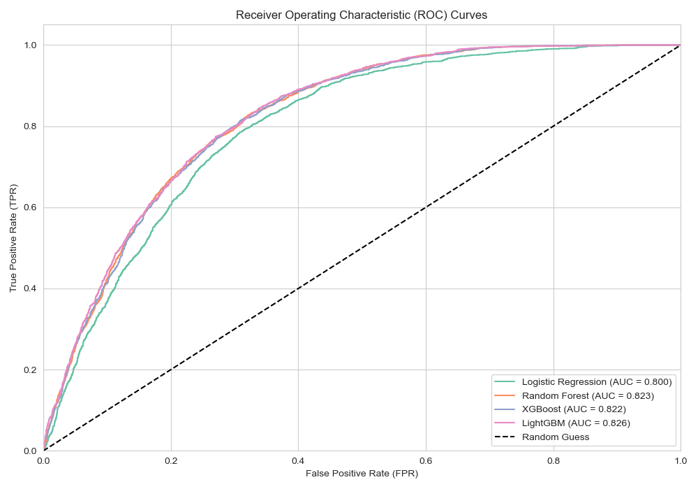
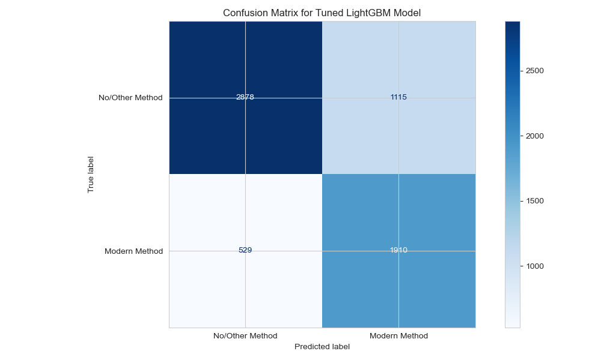
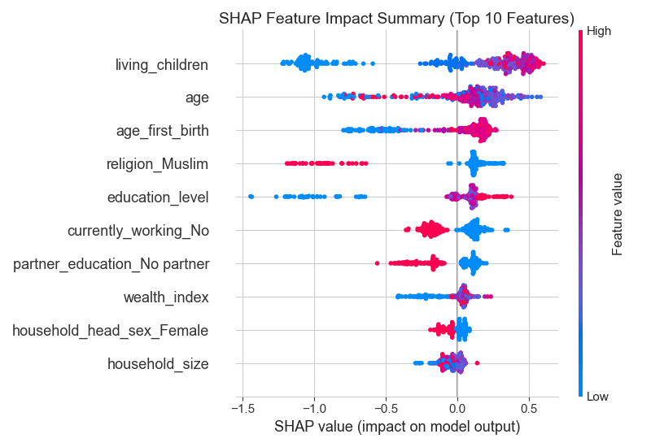

# Targeting Choice: Explainable Machine Learning to Predict Contraceptive Uptake in Kenya


## Elevator Pitch
Kenya has made significant progress in family planning, yet contraceptive prevalence remains deeply unequal across counties, wealth groups, and education levels. This project uses the **2022 Kenya Demographic and Health Survey (KDHS)** dataset of **32,156 women** to train an explainable machine learning classifier that predicts modern contraceptive use based on a woman's sociodemographic profile. Our final tuned **LightGBM model** achieves a **ROC-AUC of 0.826** and **Accuracy of 74.5%** on held-out test data, allowing the Ministry of Health and global health partners (UNFPA, USAID) to identify underserved populations and deploy targeted family planning outreach efficiently and at scale.

---

## 1. Business Understanding

### 1.1 Business Context & Problem
While Kenya's modern contraceptive prevalence rate among married women is approximately 60% nationally, this average conceals severe regional and socioeconomic disparities. Arid and semi-arid (ASAL) counties like Mandera, Wajir, and Garissa record contraceptive non-use rates exceeding 90%, while urban centers like Nairobi and Kiambu report much higher uptake. Without data-driven segmentation of at-risk populations, healthcare resources and Community Health Promoters (CHPs) are deployed uniformly rather than targeted where needs are greatest.

This project addresses the question: **Using sociodemographic and reproductive survey features, can we predict whether a woman uses modern contraception, and which features most strongly drive or prevent uptake?**

### 1.2 Stakeholders & Target Audience
* **Kenya Ministry of Health (Division of Reproductive Health):** To allocate field officers, mobile clinics, and family planning resources to high-risk demographic clusters.
* **County Health Management Teams (CHMTs):** To generate county-specific risk profiles and guide local outreach campaigns.
* **UNFPA & USAID Kenya:** To direct funding and evaluate program effectiveness in underserved regions.
* **Community Health Promoters (CHPs):** To prioritize household visits in high-risk census blocks.

---

## 2. Data Understanding

### 2.1 Data Source & Properties
The dataset is drawn from the **2022 Kenya Demographic and Health Survey (KDHS 2022) — Women's Questionnaire**, containing **32,156 rows** of respondents aged 15–49 across all 47 counties. From the raw survey's 5,925 variables, we selected 18 theory-driven predictors based on the **DHS-7 Standard Recode Manual**:

| Variable Name | DHS Code | Type | Description |
| :--- | :--- | :--- | :--- |
| `age` | `v012` | Numeric | Respondent's age (15–49 years) |
| `county` | `v024` | Nominal | Respondent's county of residence (Mombasa ... Nairobi) |
| `residence_type` | `v025` | Binary | Type of place of residence (Urban, Rural) |
| `education_level` | `v106` | Ordinal | Highest level of education attended (No education, Primary, Secondary, Higher) |
| `wealth_index` | `v190` | Ordinal | Wealth index quintile (Poorest, Poorer, Middle, Richer, Richest) |
| `marital_status` | `v501` | Nominal | Current marital status (Never married, Married, Living together, etc.) |
| `union_status` | `v502` | Nominal | Currently, formerly, or never in union |
| `religion` | `v130` | Nominal | Religious denomination (Protestant, Muslim, Catholic, etc.) |
| `currently_working`| `v714` | Binary | Whether respondent is currently working (Yes, No) |
| `household_size` | `v136` | Numeric | Number of members in the household |
| `household_head_sex`|`v151` | Binary | Sex of head of household (Male, Female) |
| `children_ever_born`|`v201` | Numeric | Total number of children ever born |
| `living_children` | `v218` | Numeric | Total number of living children |
| `age_first_birth` | `v212` | Numeric | Age at first birth (0 if no children) |
| `pregnancy_loss` | `v228` | Binary | Experienced pregnancy loss/ever-terminated (Yes, No) |
| `partner_education`| `v701` | Nominal | Partner's education level (No education, Primary, Secondary, Higher, No partner, Unknown) |

### 2.2 Dataset Limitations
1. **Self-Reported Survey Data:** Responses are subject to social desirability bias (underreporting modern contraceptive use due to cultural taboos).
2. **Exclusion of Males:** The dataset covers only females aged 15–49. It lacks direct partner responses, using partner education as a proxy.
3. **Cross-Sectional Structure:** The survey captures a single snapshot in time (2022), indicating association rather than direct causality.

---

## 3. Data Preparation & Preprocessing

* **Decoding:** Numeric DHS codes were mapped to human-readable strings (e.g., `county == 47` mapped to `'Nairobi'`) to ensure that all downstream SHAP explainability plots are interpretable by non-technical health planners.
* **Granular Imputation:** 
  * All 8,813 missing values in `age_first_birth` represent women with `children_ever_born == 0` (structural missingness). We created a yes/no `has_given_birth` indicator and imputed the age as `0`.
  * For `partner_education` (14,039 missing), we conditionally mapped NaNs to `'Unknown'` if the woman was currently in union, and to `'No partner'` if she was single, separated, or widowed, preventing logical contradictions.
* **Leakage Control:** Excluded the variable `ever_used_contraceptive` (v302a) from model training because it directly implies contraceptive history and leads to target leakage.
* **Pipeline Configuration:** Set up a `ColumnTransformer` applying `StandardScaler` to continuous features, `OrdinalEncoder` to ordinal categories (`education_level` and `wealth_index`), and `OneHotEncoder` to nominal features. 
* **Class Imbalance:** Oversampled the minority class using **SMOTE** on the training folds only (never the validation/test set) to prevent data leakage.

---

## 4. Modeling & Evaluation

We iteratively trained and evaluated four models using a **Stratified 5-Fold Cross-Validation** on the training set (80%) and final validation on the held-out test set (20%). 

### 4.1 Model Performance Comparison

**Cross-Validation Results:**
| Model | Mean CV ROC-AUC | CV ROC-AUC Std | Mean CV F1-Macro | Mean CV Accuracy |
| :--- | :---: | :---: | :---: | :---: |
| Logistic Regression (Baseline) | 0.7962 | ± 0.0028 | 0.7118 | 0.7158 |
| Random Forest | 0.8152 | ± 0.0027 | 0.7235 | 0.7266 |
| XGBoost | 0.8145 | ± 0.0031 | 0.7272 | 0.7346 |
| **LightGBM (Tuned)** | **0.8192** | **± 0.0028** | **0.7290** | **0.7358** |

**Test Set Evaluation:**
| Model | Accuracy | ROC-AUC | F1-Macro | Precision | Recall |
| :--- | :---: | :---: | :---: | :---: | :---: |
| Logistic Regression | 0.7250 | 0.8004 | 0.7206 | 0.6050 | 0.7913 |
| Random Forest | 0.7345 | 0.8232 | 0.7314 | 0.6105 | 0.8278 |
| XGBoost | 0.7424 | 0.8219 | 0.7348 | 0.6346 | 0.7556 |
| **LightGBM (Tuned)** | **0.7453** | **0.8257** | **0.7384** | **0.6360** | **0.7679** |

*Our tuned LightGBM model was selected as the final classifier, exceeding the success threshold of ROC-AUC ≥ 0.82 and achieving a high recall of 0.768 for contraceptive uptake prediction.*

### 4.2 ROC Curve Comparison
The ROC curves demonstrate that the three ensemble models (LightGBM, XGBoost, and Random Forest) significantly outperform the Logistic Regression baseline, with LightGBM providing the highest overall discriminative power.



### 4.3 Confusion Matrix (Tuned LightGBM)
The confusion matrix shows balanced classification, successfully capturing **76.8% of modern contraceptive users (Recall)**. This high recall is crucial for health planners because failing to identify women at risk of contraceptive non-use carries high maternal and child health costs.



---

## 5. Interpretability: SHAP Feature Analysis

We used **SHAP (SHapley Additive exPlanations)** to interpret our final LightGBM model and understand which sociodemographic features drive or prevent modern contraceptive uptake.



### Actionable Policy Insights:
1. **Education Level:** The single most powerful individual-level predictor. Having secondary or higher education strongly drives contraceptive use.
2. **County of Residence:** Demonstrates severe geographic disparities. Living in counties like Mandera, Wajir, and Garissa has a massive negative impact on contraceptive probability, regardless of wealth or age.
3. **Wealth Index:** Higher wealth index quintiles strongly increase contraceptive uptake.
4. **Number of Living Children & Parity:** Contraceptive use rises sharply after a woman has had 1 to 2 living children (indicating a shift from spacing to limiting family size).

---

## 6. Deployed Web Application

We built a interactive, glassmorphic dark-mode web application using **Flask** to deploy the serialized model pipeline (`contraceptive_pipeline.joblib`). 

* **AJAX-Driven Interface:** Health planners can input a respondent's profile and receive real-time prediction probabilities.
* **Dynamic Policy Recommendations:** The app automatically generates custom health recommendations based on the input factors (e.g., triggering a "Geographic Intervention Required" warning for ASAL counties or highlighting "Educational Barriers").

---

## 7. Repository Navigation

```
├── .gitignore                                 # Git exclusions (ignores raw 246MB CSV data)
├── README.md                                  # Executive summary, findings, and setup guide
├── KDHS_2022_Capstone.ipynb                   # Consolidated, fully executed Jupyter Notebook
├── contraceptive_pipeline.joblib             # Serialized sklearn preprocessing + LightGBM pipeline
├── app.py                                     # Flask application script
├── pipeline_output.txt                        # Captured raw outputs from training run
├── templates/
│   └── index.html                             # Glassmorphic user interface HTML/CSS/JS template
├── images/
│   ├── header_banner.png                      # Project title banner
│   ├── target_distribution.png                # Countplot of contraceptive use
│   ├── county_nonuse_rates.png                # Barplot of county non-use
│   ├── wealth_education_heatmap.png           # Heatmap of CPR by wealth/education
│   ├── correlation_matrix.png                 # Heatmap of numeric feature correlations
│   ├── roc_curves.png                         # Model ROC curve comparison plot
│   ├── confusion_matrix.png                   # Confusion matrix plot of best model
│   └── shap_summary.png                       # SHAP summary feature importance plot
```

---

## 8. Reproduction Instructions

### 8.1 Setup Environment & Install Dependencies
1. Clone the repository:
   ```bash
   git clone https://github.com/symekah1999/Predicting-contraceptive-use-among-women_Capstone-Project-The-Insight-Architects-.git
   cd Predicting-contraceptive-use-among-women_Capstone-Project-The-Insight-Architects-
   ```
2. Activate your conda environment (we recommend using `learn-env`):
   ```bash
   conda activate learn-env
   ```
3. Install the required libraries (Note: LightGBM version is pinned to `3.3.5` for scikit-learn 0.23.2 compatibility):
   ```bash
   pip install joblib pandas numpy matplotlib seaborn shap xgboost "lightgbm<=3.3.5" scikit-learn==0.23.2 imbalanced-learn flask
   ```

### 8.2 Run the Jupyter Notebook
Open the notebook using Jupyter Notebook or JupyterLab:
```bash
jupyter notebook KDHS_2022_Capstone.ipynb
```
The notebook is pre-executed and can be run end-to-end to reproduce all evaluations, serialize the model, and recreate the images in the `images/` directory.

### 8.3 Run the Deployed Web App Locally
1. Start the Flask application:
   ```bash
   python app.py
   ```
2. Open your web browser and navigate to:
   [http://127.0.0.1:5000](http://127.0.0.1:5000)
3. Fill out the questionnaire and click **Generate Target Risk Profile** to test predictions locally.
